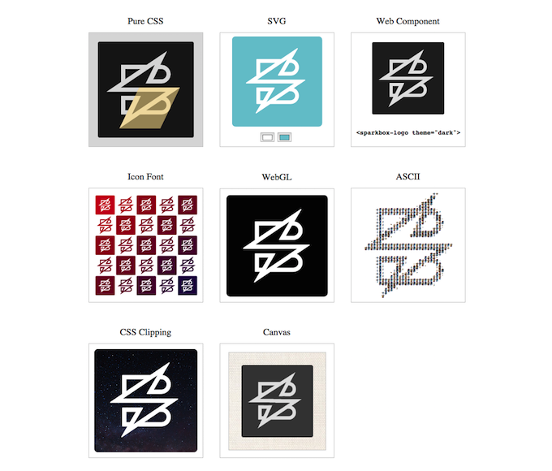

# Logo Experiments
Every possible way to draw a logo, using modern frontend techniques. I'm using the [Sparkbox](http://seesparkbox.com/) logo.

See them here: **http://bryanbraun.github.io/logo-experiments/**
(best viewed in Chrome)

## Thanks

Several of these techniques are fairly new and lack documentation. I wouldn't have been able to do them without a few key online tutorials. Special thanks goes to:

* [Greg Tavares](https://github.com/greggman), for his WebGL [code](https://github.com/greggman/webgl-fundamentals/blob/master/webgl/webgl-2d-image.html) & [tutorials](http://webglfundamentals.org/webgl/lessons/webgl-image-processing.html).
* [Mark Dalgleish](https://twitter.com/markdalgleish), for a [key post](http://markdalgleish.com/2013/11/web-components-why-youre-already-an-expert/) on Web Components that filled in the gaps.
* [Sara Soueidan](https://twitter.com/SaraSoueidan), for a sharing some [advanced examples of CSS Clipping Paths](http://sarasoueidan.com/blog/css-svg-clipping/).
